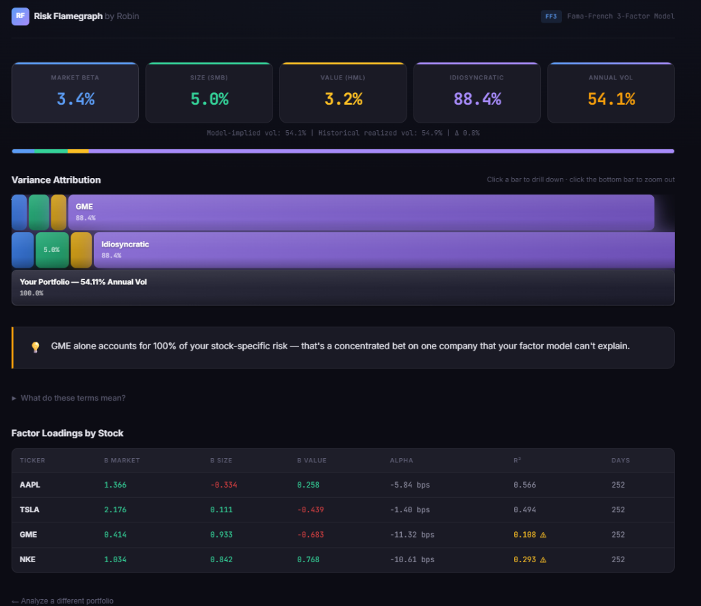

# Portfolio Risk Flamegraph



**Fama-French 3-Factor Variance Decomposition → Interactive D3.js Flamegraph**

I couldn't be bothered to spend time building a model or vibing around with where where my actual risk was coming from in my own brokerage account, so I built a factor model that decomposes portfolio variance into market / size / value / idiosyncratic components and renders it as an interactive flamegraph. Turns out 80% of what I thought was a diversified portfolio was just naked market beta.

## The Math

For each stock, we run a rolling 252-day OLS regression on the Fama-French 3-factor model:

```
r_i = α + β_mkt × MKT + β_smb × SMB + β_hml × HML + ε
```

We then decompose the full portfolio covariance matrix using **Σ = B·F·Bᵀ + D**, where B is the matrix of factor loadings, F is the 3×3 factor covariance, and D is the diagonal of residual variances. This lets us attribute total portfolio variance cleanly into:

- **Market Beta** — how much of your risk is just the stock market moving
- **SMB (Size)** — exposure to small-cap vs. large-cap return spread
- **HML (Value)** — exposure to value vs. growth return spread
- **Idiosyncratic** — stock-specific risk the factors can't explain

Cross-factor covariance terms are apportioned proportionally so the buckets always sum to 100%.

## How It Works

1. Enter your holdings (tickers + dollar values), upload a Wealthsimple CSV, or connect Questrade via OAuth
2. The backend fetches 18 months of daily prices and Fama-French factor data
3. Rolling OLS regressions produce factor betas for each position
4. Variance decomposition attributes risk to each factor
5. An interactive flamegraph shows where your risk actually lives — click to drill down, hover for details

## Running Locally

```bash
# Backend
cd backend
pip install -r requirements.txt
uvicorn main:app --port 8000

# Frontend (in another terminal)
cd frontend
python -m http.server 3000
```

Or just double-click `start.bat` on Windows.

Open `http://localhost:3000` in your browser.

## Chrome Extension

A companion Chrome extension provides a side-panel view of the flamegraph analysis, accessible from any tab.

```bash
# Load the extension
1. Go to chrome://extensions/
2. Enable "Developer mode" (top-right toggle)
3. Click "Load unpacked" → select the extension/ folder
4. Click the RF icon in your toolbar to open the side panel
```

The extension connects to your local backend (`localhost:8000` by default — configurable in the side panel).

## Data Sources

- **Stock prices**: yfinance (primary), [Stooq](https://stooq.com/) via `pandas_datareader` (fallback)
- **Factor data**: [Kenneth French Data Library](https://mba.tuck.dartmouth.edu/pages/faculty/ken.french/data_library.html) — daily Fama-French 3-factor CSV
- **FX rates**: yfinance (`CADUSD=X`) for TSX-listed stocks
- **Broker**: Questrade OAuth (optional) — one-time read-only fetch, token discarded immediately

## Tech Stack

- **Backend**: Python, FastAPI, pandas, numpy, statsmodels, pandas-datareader
- **Frontend**: Vanilla JavaScript, D3.js v7, custom CSS
- **Extension**: Chrome Manifest V3, side panel API
- **No database** — everything is stateless and in-memory per request

## Testing

```bash
cd backend
pip install pytest
pytest tests/ -v
```

## License

MIT
